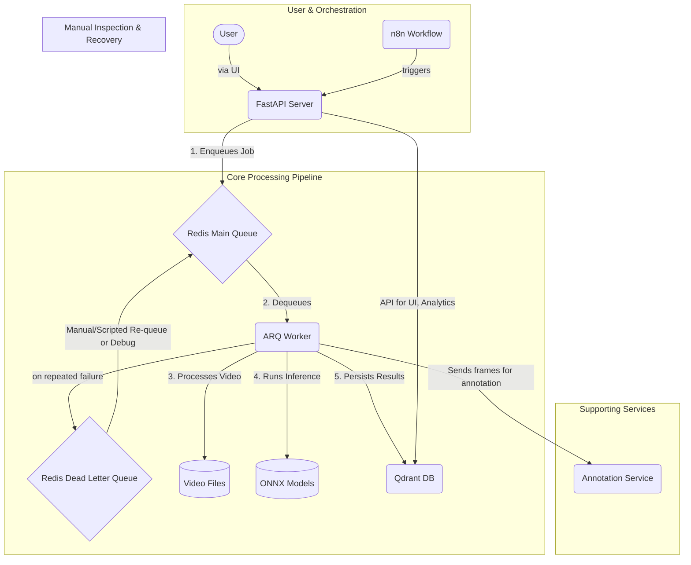

# Architectural Review Report: AI Video Analysis System

**Date:** 2025-06-25
**Author:** Architect Mode

## 1. Executive Summary

This report provides a comprehensive architectural review of the AI Video Analysis System, with a focus on improving resilience, performance, and maintainability within a "zero-budget" operational model. The current architecture, while functional, exhibits characteristics of a brittle system where component failures can lead to cascading service outages.

The core recommendation is to evolve the system's architecture towards a model of **Progressive Decoupling and Graceful Degradation**. Instead of a tightly-coupled monolith of services, we propose implementing patterns that isolate failures, allow the system to operate in a degraded state, and improve its overall robustness and operational maturity.

This review identifies critical weaknesses in four key areas and provides a strategic roadmap with concrete, zero-budget recommendations to address them:

- **Resilience & Fault Tolerance:** Implementing patterns like Circuit Breakers and Dead Letter Queues to prevent cascading failures.
- **Performance & Efficiency:** Refactoring the monolithic analysis task into a multi-stage pipeline to optimize resource usage on CPU-only hardware.
- **Maintainability & Operations:** Centralizing configuration and creating an "Operator's Toolkit" to simplify common tasks.
- **Data Governance:** Establishing an automated and auditable data lifecycle policy to prevent resource exhaustion.

By adopting these recommendations, the system can mature from its current state into a resilient, maintainable, and efficient platform capable of long-term, autonomous operation.

## 2. Architectural Blueprint & Data Flow Analysis

The system is a microservices-based architecture. The following diagram illustrates the flow of data and the proposed architectural patterns for enhanced resilience.

**Data Flow:**

1.  An analysis task is initiated either by a user via the web UI or programmatically by an n8n workflow, which calls the FastAPI `/analyze` endpoint.
2.  The FastAPI server validates the request and enqueues a job into the **Redis Main Queue**. It does not perform any heavy processing itself.
3.  The **ARQ Worker** dequeues the job and begins the analysis pipeline.
4.  If a job fails repeatedly (a "poison pill"), it is moved to a **Dead Letter Queue (DLQ)** for manual inspection, preventing it from halting the entire pipeline.
5.  The worker reads the video file, runs inference using an ONNX model, and persists the resulting embeddings and metadata into the **Qdrant DB**.
6.  The FastAPI server queries Qdrant to serve data to the UI and analytics endpoints.

---

## 3. Deep Architectural Analysis & Strategic Recommendations

### Concern 1: Resilience & Fault Tolerance

- **Finding:** The system exhibits brittle, cascading failure modes. A failure in a downstream dependency (e.g., Redis is temporarily unavailable) will crash the primary services (FastAPI, ARQ worker), leading to a complete system outage.
- **Impact:** High operational fragility. The system requires manual intervention to recover from common, transient network or service issues.
- **Strategic Recommendations (Zero-Budget):**
  1.  **Implement the Circuit Breaker Pattern:** In the FastAPI application, wrap critical external calls (to Redis and Qdrant) in a circuit breaker (e.g., using the `pybreaker` library). If Redis is down, the `/analyze` endpoint should immediately fail fast, returning a `503 Service Unavailable` status with a `Retry-After` header. This prevents the API server from crashing and signals to clients that they should back off and retry later.
  2.  **Implement a Dead Letter Queue (DLQ):** Configure the ARQ worker to automatically move jobs that fail more than a specified number of times (e.g., 3 retries) to a separate `arq:dlq` Redis queue. This isolates "poison pill" messages and ensures that one bad video file cannot block the entire analysis pipeline.
  3.  **Ensure Idempotent Workers:** The `analyze_video` task must be designed to be idempotent. This means that if a job is executed more than once (e.g., after being manually re-queued from the DLQ), it will not create duplicate data or corrupt existing results. This can be achieved by having the worker check if results for a given `video_id` already exist in Qdrant before starting the analysis.

### Concern 2: Performance & Resource Efficiency

- **Finding:** The video analysis task is a monolithic function. This makes it difficult to optimize, debug, and manage resources for the different stages of processing (I/O vs. CPU-bound).
- **Impact:** Inefficient resource use, long processing times, and difficulty in pinpointing performance bottlenecks.
- **Strategic Recommendation (Zero-Budget):**
  1.  **Refactor to a Multi-Stage Pipeline:** Decompose the single `analyze_video` ARQ task into a chain of smaller, independent tasks. This provides granular control over retries, timeouts, and resource allocation.
      - **Task 1: `preprocess_video(video_path)`:** Uses scene-change detection (e.g., `PySceneDetect`) to extract only visually distinct keyframes. On success, it enqueues the next task with a list of frame paths. This is I/O-bound.
      - **Task 2: `run_inference(frame_paths)`:** Runs the ONNX model on a batch of frames. This is the main CPU-bound stage.
      - **Task 3: `postprocess_and_store(results)`:** Calculates embeddings from model outputs and persists the final data structures to Qdrant.

### Concern 3: Maintainability & Configuration Management

- **Finding:** The system relies on implicit dependencies and scattered configuration (e.g., hardcoded values, environment variables), increasing operational complexity and the risk of misconfiguration.
- **Impact:** High operational overhead, difficult debugging, and error-prone deployments.
- **Strategic Recommendations (Zero-Budget):**
  1.  **Centralize and Validate Configuration:** All service connection details (hostnames, ports, queue names, API keys) must be managed exclusively through the Pydantic-based `settings` object. This provides a single source of truth and runtime validation, preventing the application from starting with an invalid configuration.
  2.  **Create an "Operator's Toolkit":** Establish a `scripts/` directory with well-documented shell scripts for essential operational tasks. This abstracts away complex `docker-compose` or `kubectl` commands and reduces the chance of human error.
      - `scripts/check_system_health.sh`: Calls deep health check endpoints on all services.
      - `scripts/view_queue_size.sh`: Reports the number of jobs in the main queue and the DLQ.
      - `scripts/retry_failed_jobs.sh`: A script to inspect and re-queue jobs from the DLQ.

### Concern 4: Data Governance & Auditable Lifecycle

- **Finding:** The system has no defined data retention or lifecycle policy. Raw video files and vector embeddings will accumulate indefinitely.
- **Impact:** Guaranteed eventual failure due to disk space exhaustion. This is a critical violation of the "zero-budget" principle of sustainable operation.
- **Strategic Recommendation (Zero-Budget):**
  1.  **Implement an Auditable Cleanup Workflow:** Create a robust n8n workflow (or a Python script run via cron) that performs automated, auditable cleanup.
      - **Query:** Find all data points in Qdrant with a `creation_timestamp` older than the defined retention period (e.g., 30 days).
      - **Log Intent:** For each item, log the `video_id` and `vector_id` to be deleted to a dedicated `cleanup.log` file.
      - **Execute & Verify:** Attempt to delete the vector from Qdrant. On success, attempt to delete the corresponding video file.
      - **Log Outcome:** Log the outcome (success/failure) for each step to the `cleanup.log`. This audit trail is essential for debugging and ensuring the cleanup process is working as expected.

---

## 4. Architectural Maturity Roadmap

This roadmap provides a clear vision for evolving the system's architecture over time.

- **Level 0 (Current State): Brittle & High-Maintenance**

  - Characterized by cascading failures, monolithic processing, and manual, error-prone operations.

- **Level 1 (Target of this Review): Resilient & Maintainable**

  - **Achieved by:** Implementing Circuit Breakers, Dead Letter Queues, a Multi-Stage Pipeline, and an Auditable Cleanup Workflow.
  - **Outcome:** The system can survive common component failures, isolates problematic data, and is significantly easier and safer to operate.

- **Level 2 (Future Vision): Automated & Self-Healing**
  - **Achieved by:** Introducing automated health checks in `docker-compose` to restart failing services, and implementing script-based autoscaling of ARQ workers based on queue length.
  - **Outcome:** The system can automatically recover from certain failures and can adapt its resource usage to the current workload, further reducing the need for manual intervention.
