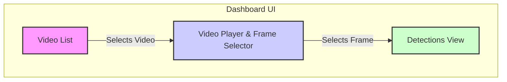

# Analytics & Visualization Dashboard Design

**Version:** 1.0
**Date:** 2025-06-25
**Author:** Architect Mode

## 1. Overview

This document outlines the design for a lightweight frontend dashboard to visualize the results of the AI Video Analysis System. The primary goal is to provide a simple, intuitive interface for users to browse processed videos, view analysis results frame-by-frame, and understand the system's output without needing direct database access.

This design follows the "Zero-Budget" principle by proposing a simple React frontend served as static files by the existing FastAPI backend, minimizing new infrastructure requirements.

## 2. UI/UX Design

The dashboard will be a single-page application (SPA) built with React. It will feature a clean, three-panel layout.

### 2.1. Low-Fidelity Wireframe



### 2.2. Component Descriptions

#### 2.2.1. Video List (Panel A)

- **Purpose:** Displays a list of all unique videos that have been processed by the system.
- **Content:** Each item in the list should display the video's filename or a unique identifier.
- **Interaction:**
  - On page load, this panel is populated by calling the `GET /videos` endpoint.
  - Clicking on a video in the list will load its data into the Video Player (Panel B) and Detections View (Panel C).

#### 2.2.2. Video Player & Frame Selector (Panel B)

- **Purpose:** Allows the user to watch the selected video and navigate between its frames.
- **Content:**
  - An HTML5 video player to display the source video.
  - A slider or scrub bar to navigate through the frames of the video. The slider will be synchronized with the video playback.
- **Interaction:**
  - When a video is selected from the list, the player is loaded with the corresponding video file. The frame data is fetched via `GET /videos/{video_id}/frames`.
  - As the user scrubs the slider or as the video plays, the current frame number is updated. This triggers an update in the Detections View (Panel C) to show the bounding boxes for that specific frame.

#### 2.2.3. Detections View (Panel C)

- **Purpose:** Visualizes the object detection results for the currently selected frame.
- **Content:**
  - A static image of the currently selected frame.
  - Overlaid bounding boxes for all detected objects in that frame. Each box should be color-coded by its label.
  - A list of detected objects, including their labels and confidence scores.
- **Interaction:**
  - This view updates automatically whenever the selected frame changes in the Video Player panel.
  - Hovering over a bounding box could highlight the corresponding item in the detections list, and vice-versa.

## 3. API Endpoint Design

The following new endpoints will be added to the FastAPI application in [`src/video_ai_system/main.py`](./src/video_ai_system/main.py).

### 3.1. `GET /videos`

- **Purpose:** Retrieve a list of all unique video IDs/names that have been processed and stored.
- **Implementation:** This endpoint will use the `AnalyticsService` to query the Qdrant vector store. The query will not fetch vectors, but rather scroll through all points and aggregate the unique values of a specific metadata field (e.g., `video_id` or `source_video_filename`).
- **Response Body Schema:**
  ```json
  {
    "videos": ["video_001.mp4", "traffic_cam_02.mp4", "factory_line_A.mov"]
  }
  ```
- **Pydantic Model:**

  ```python
  from pydantic import BaseModel
  from typing import List

  class VideoListResponse(BaseModel):
      videos: List[str]
  ```

### 3.2. `GET /videos/{video_id}/frames`

- **Purpose:** Retrieve all frame data, including metadata and object detections, for a specific video.
- **Path Parameter:**
  - `video_id`: The unique identifier for the video (e.g., the filename).
- **Implementation:** This endpoint will use the `AnalyticsService` to perform a filtered scroll operation in Qdrant. It will retrieve all points where the metadata field `video_id` matches the provided ID.
- **Response Body Schema:**
  ```json
  {
    "video_id": "video_001.mp4",
    "frames": [
      {
        "frame_number": 1,
        "timestamp": 0.04,
        "detections": [
          {
            "label": "car",
            "confidence": 0.92,
            "box": [100, 150, 180, 220]
          }
        ]
      },
      {
        "frame_number": 2,
        "timestamp": 0.08,
        "detections": []
      }
    ]
  }
  ```
- **Pydantic Models:**

  ```python
  from pydantic import BaseModel
  from typing import List, Tuple

  class Detection(BaseModel):
      label: str
      confidence: float
      box: Tuple[int, int, int, int] # (x1, y1, x2, y2)

  class FrameData(BaseModel):
      frame_number: int
      timestamp: float
      detections: List[Detection]

  class FrameDataResponse(BaseModel):
      video_id: str
      frames: List[FrameData]
  ```

## 4. `AnalyticsService` Design

A new service will be created to encapsulate the business logic for retrieving analytics data from the vector database.

- **File:** `src/video_ai_system/services/analytics_service.py`
- **Class:** `AnalyticsService`

### 4.1. Class Structure

```python
from .vector_db_service import VectorDBService

class AnalyticsService:
    def __init__(self, vector_db_service: VectorDBService):
        """
        Initializes the AnalyticsService.

        Args:
            vector_db_service: An instance of the VectorDBService to interact with Qdrant.
        """
        self.db_service = vector_db_service

    async def get_unique_video_ids(self) -> list[str]:
        """
        Retrieves a list of unique video IDs from the vector database.
        """
        # Logic to scroll through Qdrant points and collect unique video_id metadata.
        pass

    async def get_frames_for_video(self, video_id: str) -> list[dict]:
        """
        Retrieves all frame data for a given video ID.

        Args:
            video_id: The unique identifier for the video.

        Returns:
            A list of dictionaries, where each dictionary represents a frame's data.
        """
        # Logic to perform a filtered scroll on Qdrant using a must filter on video_id.
        pass
```

This service will be instantiated once and injected into the FastAPI application context, making it available to the API route handlers. It will depend on the existing `VectorDBService`.

## 5. Deployment & Frontend Integration

- **Frontend Build:** The React application will be built into a set of static assets (`index.html`, CSS, and JavaScript files).
- **Serving Static Files:** For simplicity and to adhere to the "Zero-Budget" approach, the FastAPI application will be configured to serve these static files. This avoids the need for a separate web server (like Nginx) just for the frontend.
- **CORS:** The FastAPI application must be configured with the appropriate CORS (Cross-Origin Resource Sharing) middleware to allow requests from the frontend, especially during local development when the React dev server runs on a different port.

## 6. Next Steps & Cross-Mode Handoff

- **To Code Mode:**
  1.  Implement the `AnalyticsService` in [`src/video_ai_system/services/analytics_service.py`](./src/video_ai_system/services/analytics_service.py).
  2.  Implement the `GET /videos` and `GET /videos/{video_id}/frames` endpoints in [`src/video_ai_system/main.py`](./src/video_ai_system/main.py), using the `AnalyticsService`.
  3.  Create a new React application in a `frontend` directory at the root of the `video-ai-system` project.
  4.  Implement the three-panel UI as described in the wireframe.
  5.  Configure FastAPI to serve the static build of the React app.
- **To DevOps Mode:**
  1.  Update the `Dockerfile` to include the build step for the new React frontend.
  2.  Ensure the container exposes the necessary ports and the static files are served correctly.
