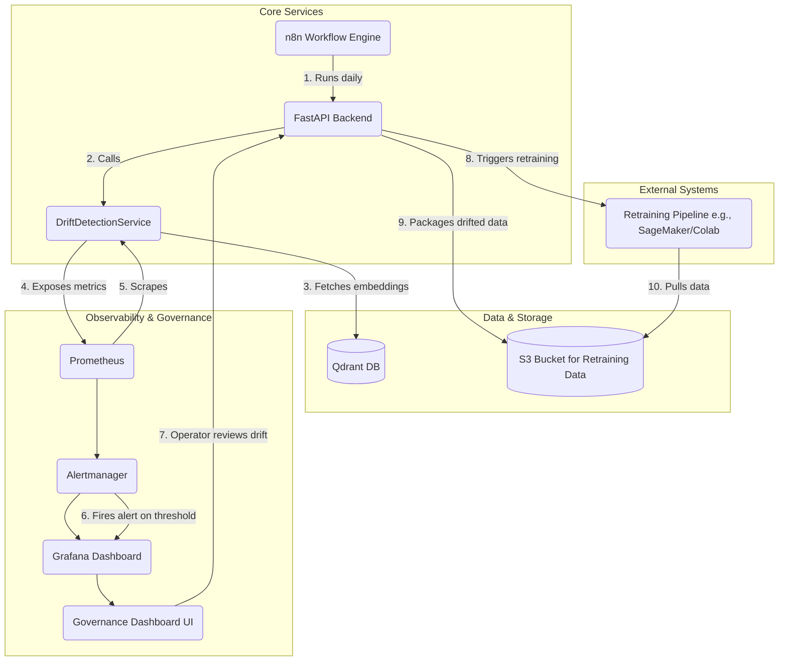
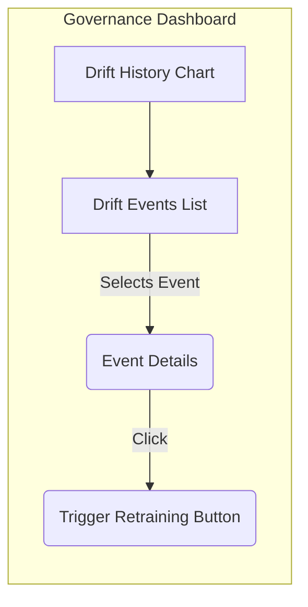

# Drift Detection & Retraining Workflow Design

**Version:** 2.0
**Date:** 2025-06-30
**Author:** Architect Mode

## 1. Overview

This document outlines the end-to-end design for the Drift Detection and Automated Retraining workflow. The system provides a comprehensive mechanism to detect data and model drift, alert operators, provide governance oversight, and trigger model retraining with human-in-the-loop approval.

This expanded design moves beyond on-demand checks to a fully automated, observable, and governable MLOps lifecycle component, as required for **Phase 2: Model Lifecycle Management & Governance**.

### 1.1. High-Level Architecture

The workflow integrates several components of the system to form a closed loop for model maintenance.



**Workflow Steps:**

1.  **Scheduled Check (n8n)**: An n8n workflow runs on a daily schedule, calling the system's drift detection API.
2.  **Drift Calculation (`DriftDetectionService`)**: The service fetches embedding vectors from Qdrant for a reference window (e.g., last week) and a comparison window (e.g., last 24 hours).
3.  **Metrics Exposure**: The service calculates a drift score and exposes it as a Prometheus metric.
4.  **Monitoring & Alerting (Prometheus)**: Prometheus scrapes the metric. If the drift score exceeds a predefined threshold, Alertmanager fires an alert.
5.  **Visualization (Grafana)**: The alert is displayed on the Governance Dashboard, which includes Grafana panels showing drift over time.
6.  **Human-in-the-Loop Review**: An operator reviews the drift event in the dashboard. The UI provides context, including the drift score and visualizations of the drifted data distributions.
7.  **Retraining Trigger**: If the operator confirms the need for retraining, they click a button in the UI.
8.  **Triggering External Pipeline**: This action calls a new `/retrain` API endpoint, which is responsible for initiating the external retraining pipeline (e.g., via a webhook).
9.  **Data Packaging**: The backend packages a representative sample of the drifted data and uploads it to an S3 bucket.
10. **Model Retraining**: The external pipeline is triggered, pulls the new data from S3, and begins the retraining process.

## 2. Drift Computation Logic

The `DriftDetectionService` will be enhanced to support multiple drift detection methods and data types.

### 2.1. Statistical Methods

While the initial design proposed KL Divergence, we will make the system extensible to other methods.

- **Primary Method: Kullback-Leibler (KL) Divergence**:

  - **How it works**: Measures the difference between two probability distributions. We first reduce embedding dimensionality with PCA, then use Kernel Density Estimation (KDE) to model the probability distribution of each data window before calculating the KL divergence.
  - **Pros**: Fast to compute, sensitive to changes in the core probability mass.
  - **Cons**: Can be unstable if distributions have regions with zero probability.

- **Alternative Method: Earth Mover's Distance (EMD)**:
  - **How it works**: Measures the "work" required to transform one distribution into another. It is less sensitive to the exact shape and more to the distance between distributions.
  - **Pros**: More robust than KL divergence, especially for high-dimensional data or when distributions don't overlap perfectly.
  - **Cons**: More computationally expensive.
  - **Action**: This will be a research task for **Project Research Mode** to evaluate its effectiveness on our data.

### 2.2. Data Sources for Drift Analysis

Drift will be calculated on two sources:

1.  **Feature Embeddings**: The primary source, as described above. This detects **data drift**.
2.  **Model Confidence Scores**: The distribution of the model's output confidence scores. This is a powerful and cheap proxy for **concept drift** (i.e., the model is becoming less certain about its predictions).

## 3. Monitoring & Alerting

The `DriftDetectionService` will expose metrics for Prometheus scraping.

### 3.1. Prometheus Metrics

The following metrics will be exposed via the `/metrics` endpoint (using `starlette-prometheus`):

- `video_ai_drift_score`: A Gauge metric to store the latest drift score. It will have labels to distinguish the method and data source.
  - `method`: "kl_divergence" or "emd"
  - `source`: "embeddings" or "confidence_scores"
- `video_ai_drift_check_duration_seconds`: A Histogram to track the latency of the drift check operation.
- `video_ai_drift_detected_total`: A Counter that increments every time a drift check returns `drift_detected: true`.

### 3.2. Prometheus Alerting Rules

A rule file will be configured in Prometheus to trigger alerts.

**`alert.rules.yml`:**

```yaml
groups:
  - name: ModelDriftAlerts
    rules:
      - alert: HighDriftDetected
        expr: video_ai_drift_score{method="kl_divergence", source="embeddings"} > 0.1
        for: 1h
        labels:
          severity: warning
        annotations:
          summary: "High data drift detected (value: {{ $value }})"
          description: "The KL divergence between reference and comparison embedding distributions has exceeded the threshold of 0.1 for over an hour."
```

## 4. Governance Dashboard & Retraining Workflow

The existing frontend application will be extended with a "Model Governance" section.

### 4.1. UI Design

A new tab/view will be added to the React dashboard.



- **Drift History Chart**: An embedded Grafana panel showing the `video_ai_drift_score` over time.
- **Drift Events List**: A table of all triggered `HighDriftDetected` alerts. This will be populated by a new API endpoint.
  - **Columns**: Event ID, Timestamp, Drift Score, Status (e.g., `NEEDS_REVIEW`, `ACTIONED`, `IGNORED`).
- **Trigger Retraining Button**: A button that becomes active when an operator selects an event with status `NEEDS_REVIEW`.

### 4.2. New API Endpoints

#### `GET /drift-events`

- **Purpose**: Retrieve a list of all historical drift alerts for display in the Governance Dashboard.
- **Implementation**: This endpoint will query a new simple database table or a dedicated log stream where alerts are persisted.
- **Success Response (200 OK)**:
  ```json
  {
    "events": [
      {
        "event_id": "evt_abc123",
        "timestamp": "2025-06-30T10:00:00Z",
        "drift_score": 0.18,
        "status": "NEEDS_REVIEW",
        "reference_window": { "start_time": "...", "end_time": "..." },
        "comparison_window": { "start_time": "...", "end_time": "..." }
      }
    ]
  }
  ```

#### `POST /retrain`

- **Purpose**: To acknowledge a drift event and trigger the external retraining pipeline. This is the "human-in-the-loop" approval step.
- **Request Body**:
  ```json
  {
    "event_id": "evt_abc123",
    "action": "TRIGGER_RETRAINING" // or "IGNORE"
  }
  ```
- **Implementation Logic**:
  1.  Validate the `event_id`.
  2.  Update the event status in the database to `ACTIONED`.
  3.  **Asynchronously**:
      a. Fetch a representative sample of point IDs from the comparison window from Qdrant.
      b. Package the corresponding data (e.g., video frames) into a `.zip` or `.tar.gz` file.
      c. Upload the packaged data to a pre-configured S3 bucket (e.g., `s3://video-ai-retraining-data/batch-xyz.zip`).
      d. Trigger the retraining pipeline by sending a `POST` request to a configured webhook URL, passing the S3 path as a parameter.
- **Success Response (202 Accepted)**:
  ```json
  {
    "status": "Retraining pipeline triggered successfully",
    "retraining_job_id": "job-789"
  }
  ```

## 5. Assumptions & Fallbacks

- **A2.1**: A persistent storage mechanism (e.g., a simple SQLite DB or a dedicated log file) is available for storing drift events. **Status**: pending. **Validation**: Confirm with DevOps.
- **A2.2**: A pre-configured S3 bucket and credentials are provided for storing retraining data. **Status**: pending. **Validation**: Confirm with DevOps.
- **A2.3**: The external retraining pipeline exposes a secure webhook URL that can be called by the API. **Status**: pending. **Validation**: Define contract with the team managing the training environment.
- **F2.1**: If the retraining webhook fails, the system will retry up to 3 times with exponential backoff. If it still fails, the event status will be marked as `RETRAINING_FAILED` and an alert will be sent to the operations team.

## 6. Cross-Mode Instructions

- **To Code Mode**:

  1.  Update the `DriftDetectionService` to expose Prometheus metrics (`video_ai_drift_score`, etc.).
  2.  Implement the new API endpoints: `GET /drift-events` and `POST /retrain`.
  3.  Implement the asynchronous logic for packaging data and triggering the retraining webhook.
  4.  In the `frontend` app, create the "Model Governance" view with the specified components.
  5.  Add a simple persistence layer for drift events.

- **To DevOps Mode**:

  1.  Configure Prometheus with the `alert.rules.yml` for model drift.
  2.  Configure Alertmanager to route `HighDriftDetected` alerts to the appropriate channel and potentially a webhook that writes to the drift events database.
  3.  Provision the S3 bucket for retraining data and provide the necessary access credentials to the application.
  4.  Manage the secret for the retraining pipeline's webhook URL.

- **To Documentation Writer Mode**:

  1.  Create a user guide for the "Model Governance" dashboard.
  2.  Document the process for reviewing a drift event and triggering a retraining run.

- **To Project Research Mode**:
  1.  Initiate a research task to compare the performance and computational cost of KL Divergence vs. Earth Mover's Distance for detecting drift in our video embeddings.
