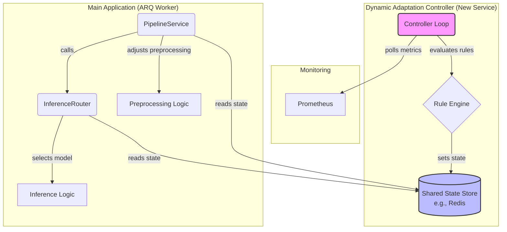

# Design: Dynamic Adaptation Controller

**Version:** 1.0
**Author:** Architect Mode
**Status:** Proposed

## 1. Overview & Goals

This document outlines the architecture for the `Dynamic Adaptation Controller`, a new component introduced in Phase 3. The primary goal of this controller is to monitor the system's real-time performance and resource utilization, and dynamically adjust its operational parameters to maintain stability, efficiency, and responsiveness under varying loads.

This controller will act as the central "nervous system" for runtime optimization, enabling the application to gracefully degrade performance when under stress and recover when conditions normalize.

### Success Metrics:

- **Metric-1 (Responsiveness):** The system shall adapt to a sustained load increase (e.g., CPU usage > 90% for 60s) within 2 minutes by switching to a degraded operational state.
- **Metric-2 (Stability):** The controller must prevent rapid "flapping" between states, ensuring a state change is maintained for at least 5 minutes before another change can occur.
- **Metric-3 (Auditability):** Every adaptation decision (e.g., switching from `NORMAL` to `DEGRADED`) MUST be logged with the causal metric values.

## 2. Architecture

The proposed architecture introduces a new, standalone `DynamicAdaptationController` service that operates independently of the main application worker. This service polls metrics from Prometheus, evaluates a set of configurable rules, and publishes the resulting system state to a shared, fast-access data store (e.g., Redis or a memory-mapped file).

Core application components, such as the `PipelineService` and `InferenceRouter`, will read this shared state to modify their behavior accordingly.



## 3. Detailed Component Design

### 3.1. `DynamicAdaptationController` Service

- **Type:** A long-running, standalone Python process (or container).
- **Logic:**
  1.  On startup, load adaptation rules from the central configuration.
  2.  Enter a main loop that wakes at a configurable `polling_interval_seconds`.
  3.  In each loop iteration, query the Prometheus HTTP API for the required metrics (e.g., `inference_latency_seconds_p95`, `cpu_usage_percent`).
  4.  Pass the fetched metrics to the `RuleEngine`.
  5.  If the engine returns a new state that is different from the current state, publish it to the `SharedStateStore`.
  6.  Log the state change and the metrics that triggered it.
  7.  Implement a "cool-down" mechanism to adhere to **Metric-2**.

### 3.2. Rule Engine

- **Type:** A simple, data-driven module within the controller.
- **Logic:** It iterates through a list of rules, ordered by priority (e.g., `CRITICAL` rules first). The first rule that matches the current metrics determines the new system state. If no rules match, the state defaults to `NORMAL`.

### 3.3. Shared State Store

- **Requirement:** A low-latency mechanism for inter-process communication.
- **Recommended Approach:** **Redis**. It is fast, network-accessible (which supports containerized deployments), and atomic operations prevent race conditions.
- **Alternative:** A memory-mapped file or a simple file in a shared volume. This is simpler for single-host deployments but less scalable and more prone to file locking issues.
- **State Representation:** A simple key-value pair, e.g., `system:adaptation_level` -> `"DEGRADED"`.

## 4. Adaptation Strategies

The controller will manage a set of discrete operational levels. The actions associated with each level are implemented by the consumer services.

| Level        | Trigger Example  | `InferenceRouter` Action                                       | `PipelineService` Action                                |
| :----------- | :--------------- | :------------------------------------------------------------- | :------------------------------------------------------ |
| **CRITICAL** | `latency > 2.0s` | Use fastest, lowest-quality model (e.g., quantized `v5-tiny`). | Reduce frame rate by 50%. Defer all non-critical tasks. |
| **DEGRADED** | `cpu > 85%`      | Use a lighter-weight model (e.g., `v4-light`).                 | Reduce frame rate by 25%.                               |
| **NORMAL**   | (Default)        | Use standard production model (e.g., `v3-balanced`).           | Use default frame rate.                                 |

## 5. Configuration

A new `adaptation_controller` section will be added to [`config.schema.json`](../config/config.schema.json).

```json
{
  "adaptation_controller": {
    "description": "Configuration for the Dynamic Adaptation Controller.",
    "type": "object",
    "properties": {
      "enabled": { "type": "boolean", "default": true },
      "polling_interval_seconds": { "type": "integer", "default": 15 },
      "cooldown_seconds": { "type": "integer", "default": 300 },
      "prometheus_url": { "type": "string", "format": "uri" },
      "shared_state_provider": {
        "type": "string",
        "enum": ["redis", "file"],
        "default": "redis"
      },
      "rules": {
        "type": "array",
        "items": {
          "type": "object",
          "properties": {
            "level": {
              "type": "string",
              "enum": ["CRITICAL", "DEGRADED", "NORMAL"]
            },
            "metric": { "type": "string" },
            "threshold": { "type": "number" },
            "operator": { "type": "string", "enum": [">", "<", ">=", "<="] }
          },
          "required": ["level", "metric", "threshold", "operator"]
        }
      }
    },
    "required": ["prometheus_url", "rules"]
  }
}
```

## 6. Integration & API Changes

### 6.1. `InferenceRouter`

The `InferenceRouter` will be refactored. The simple canary logic will be replaced by state-driven logic.

- **Modification:** The `get_target_model` method will be enhanced to:
  1.  Read the current adaptation level from the `SharedStateStore`.
  2.  Look up the appropriate model version for that level from a mapping in the configuration.
  3.  Return the selected model identifier.
  4.  It must be resilient to failures in reading the state, defaulting to `NORMAL`.

### 6.2. `PipelineService`

- **Modification:** The `process_video` method will be updated:
  1.  Before starting the keyframe loop, it will read the adaptation level from the `SharedStateStore`.
  2.  Based on the level, it will adjust the parameters passed to the `PreprocessingService` (e.g., by modifying the `fps` target).

## 7. Safety, Logging, and Monitoring

- **Logging:** All state transitions will be logged to the `AuditService` with structured context (e.g., `{"event": "adaptation_state_change", "new_level": "DEGRADED", "trigger_metric": "cpu_usage_percent", "value": 92.5}`).
- **Safety:** If the controller service is down, consuming services MUST default to the `NORMAL` state. Health checks for the controller are critical.
- **Monitoring the Controller:** The controller itself will expose metrics to Prometheus, such as `adaptation_controller_last_run_success`, `adaptation_controller_current_level`, and `adaptation_controller_polls_total`.

## 8. Validation Plan

- **Unit Tests:**
  - Test the `RuleEngine` with various metric inputs to ensure correct level selection.
  - Test the `InferenceRouter`'s new logic with a mocked state store.
- **Integration Tests:**
  - In a `docker-compose` environment, manually set the state in Redis and verify that a call to the `PipelineService` results in the use of the correct model (verified via logs or response metadata).
- **Chaos & Performance Tests:**
  - Use a load-testing tool to stress the `InferenceService`.
  - Verify that Prometheus metrics are generated, the `DynamicAdaptationController` detects the high load, changes the state in Redis, and the system correctly throttles its behavior.
  - Measure the time from load injection to adaptation to validate **Metric-1**.
