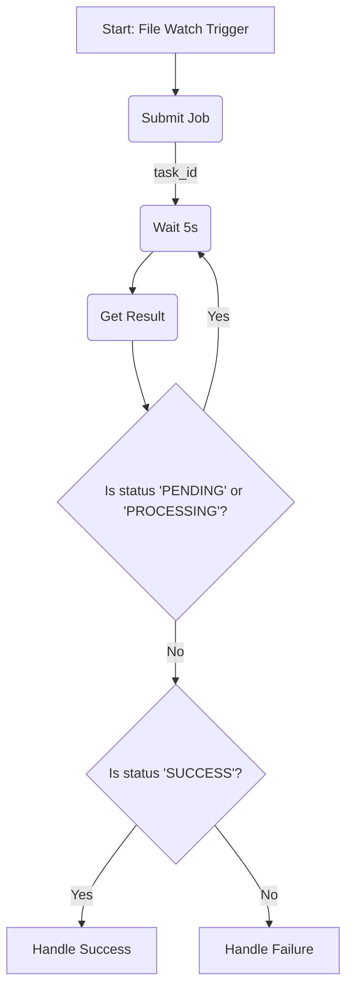
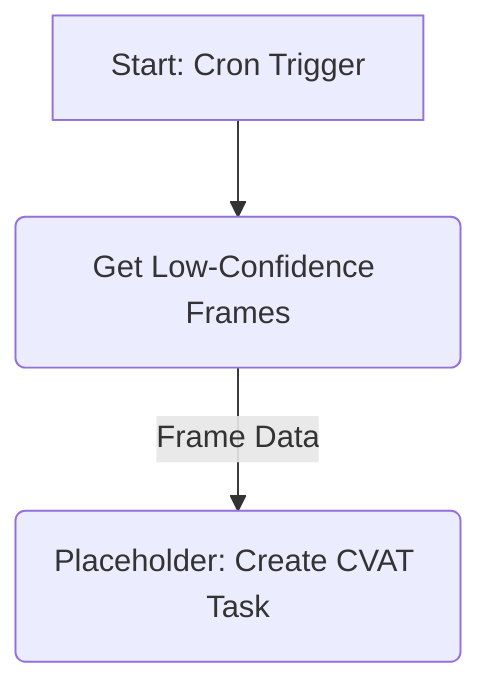
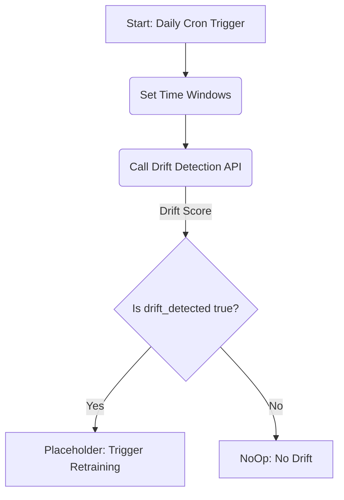

# n8n Workflow Designs

This document outlines the design of workflows managed by n8n for the AI Video Analysis System.

## 1. Video Analysis Workflow (Event-Triggered)

### 1.1. Overview

This workflow is triggered when a new video file is added to a designated directory. It orchestrates the entire analysis pipeline from preprocessing to storing results. This pattern decouples the file drop event from the completion of the potentially long-running analysis task, ensuring robustness.

### 1.2. Workflow Diagram

The following diagram illustrates the logical flow of the workflow.



### 1.3. Node-by-Node Breakdown

#### 1.3.1. Start: File Watch Trigger

- **Node Type**: `On File Change Trigger` (or equivalent n8n node)
- **Purpose**: To provide an entry point into the workflow. It watches a specific directory for new files.
- **Configuration**:
  - **Path to watch**: `/data/incoming` (See Assumption `A-n8n-2`)
  - **Events**: `create`
- **Output**: The node will output data for each new file, including the full `path`.
  ```json
  {
    "path": "/data/incoming/new_video_123.mp4",
    "filename": "new_video_123.mp4",
    "size": 12345678
  }
  ```

#### 1.3.2. Submit Job

- **Node Type**: `HTTP Request`
- **Purpose**: To submit the video analysis job to our backend API using the file path.
- **Configuration**:
  - **Method**: `POST`
  - **URL**: `http://host.docker.internal:8000/analyze` (See Assumption `A-n8n-1`)
  - **Body**: `{"file_path": "{{$json.path}}"}`
- **Output**: A JSON response from the API, expected to contain the `task_id`.
  ```json
  {
    "task_id": "abc-123-def-456"
  }
  ```

#### 1.3.3. Wait 5s

- **Node Type**: `Wait`
- **Purpose**: To introduce a delay in the polling loop, preventing the workflow from overwhelming the results endpoint.
- **Configuration**: Wait for a fixed duration of 5 seconds.

#### 1.3.4. Get Result

- **Node Type**: `HTTP Request`
- **Purpose**: To poll the results endpoint to check the status of the analysis task.
- **Configuration**:
  - **Method**: `GET`
  - **URL**: `http://host.docker.internal:8000/results/{{$node["Submit Job"].json.task_id}}`
- **Output**: A JSON response containing the task status.
  ```json
  {
    "task_id": "abc-123-def-456",
    "status": "PROCESSING", // or PENDING, SUCCESS, FAILED
    "result": null // or analysis data
  }
  ```

#### 1.3.5. Is status 'PENDING' or 'PROCESSING'?

- **Node Type**: `IF`
- **Purpose**: To create the polling loop. It checks if the task is still running.
- **Configuration**: Checks if `{{$node["Get Result"].json.status}}` is equal to `PENDING` or `PROCESSING`.
- **Output Branches**:
  - `true`: The task is still running. The flow is directed back to the `Wait 5s` node.
  - `false`: The task has reached a terminal state (`SUCCESS` or `FAILED`). The flow continues to the final outcome check.

#### 1.3.6. Is status 'SUCCESS'?

- **Node Type**: `IF`
- **Purpose**: To determine the final outcome of the task and route the workflow accordingly.
- **Configuration**: Checks if `{{$node["Get Result"].json.status}}` is equal to `SUCCESS`.
- **Output Branches**:
  - `true`: The analysis was successful.
  - `false`: The analysis failed.

#### 1.3.7. Handle Success

- **Node Type**: `NoOp (Do Nothing)`
- **Purpose**: A placeholder for the actions to be taken upon successful analysis (e.g., send an email, trigger another workflow, update a database).

#### 1.3.8. Handle Failure

- **Node Type**: `NoOp (Do Nothing)`
- **Purpose**: A placeholder for the actions to be taken upon a failed analysis (e.g., send an alert to an administrator, log the failure details).

## 2. Active Learning Annotation Workflow (Scheduled)

This workflow runs on a schedule to find low-confidence frames and prepare them for annotation, forming a key part of the active learning loop.

### 2.1. Workflow Diagram



### 2.2. Node-by-Node Breakdown

#### 2.2.1. Start: Cron Trigger

- **Node Type**: `Cron`
- **Purpose**: To trigger the workflow on a recurring schedule.
- **Configuration**:
  - **Mode**: `Every Hour` (This is configurable and can be adjusted based on the rate of new data and annotation capacity).
- **Output**: Executes the workflow once per hour.

#### 2.2.2. Get Low-Confidence Frames

- **Node Type**: `HTTP Request`
- **Purpose**: To call the API endpoint that returns frames needing annotation.
- **Configuration**:
  - **Method**: `GET`
  - **URL**: `http://host.docker.internal:8000/active-learning/low-confidence-frames`
  - **Parameters**:
    - `confidence_threshold`: `0.6` (Example value, can be configured)
    - `limit`: `50` (Example value, to control batch size)
- **Output**: A JSON array of low-confidence frame objects, as specified in the `active_learning_design.md`.

#### 2.2.3. Placeholder: Create CVAT Task

- **Node Type**: `NoOp (Do Nothing)`
- **Purpose**: This is a placeholder for a future node. In a subsequent phase, this node will be replaced with one or more nodes that interact with the CVAT API to:
  1.  Check if a task for the given `video_path` already exists.
  2.  If not, create a new task in CVAT.
  3.  Upload the relevant frame data to the task.
- **Input**: The array of low-confidence frames from the previous step.

## 3. Scheduled Drift Detection Workflow

This workflow runs on a fixed schedule to automatically check for data drift between recent and historical data, enabling proactive model maintenance.

### 3.1. Workflow Diagram



### 3.2. Node-by-Node Breakdown

#### 3.2.1. Start: Daily Cron Trigger

- **Node Type**: `Cron`
- **Purpose**: To trigger the workflow automatically at a regular interval.
- **Configuration**:
  - **Mode**: `Daily`
  - **Time**: `01:00` (Runs once per day at 1 AM)
- **Output**: Executes the workflow once per day.

#### 3.2.2. Set Time Windows

- **Node Type**: `Function`
- **Purpose**: To dynamically calculate the timestamps for the reference and comparison windows. This avoids hardcoding dates and makes the workflow reusable.
- **Code**:

  ```javascript
  // Get current date
  const now = new Date();

  // Comparison window: last 24 hours
  const comp_end = new Date(now);
  const comp_start = new Date(now);
  comp_start.setDate(comp_start.getDate() - 1);

  // Reference window: the 24 hours before that
  const ref_end = new Date(comp_start);
  const ref_start = new Date(comp_start);
  ref_start.setDate(ref_start.getDate() - 1);

  // Format for API
  item.reference_window = {
    start_time: ref_start.toISOString(),
    end_time: ref_end.toISOString(),
  };
  item.comparison_window = {
    start_time: comp_start.toISOString(),
    end_time: comp_end.toISOString(),
  };

  return item;
  ```

- **Output**: A JSON object containing the two time windows.

#### 3.2.3. Call Drift Detection API

- **Node Type**: `HTTP Request`
- **Purpose**: To call the backend API to perform the drift analysis.
- **Configuration**:
  - **Method**: `POST`
  - **URL**: `http://host.docker.internal:8000/drift-detection/check` (See Assumption `A-n8n-1`)
  - **Body Content Type**: `JSON`
  - **Body**:
    ```json
    {
      "reference_window": {
        "start_time": "{{$json.reference_window.start_time}}",
        "end_time": "{{$json.reference_window.end_time}}"
      },
      "comparison_window": {
        "start_time": "{{$json.comparison_window.start_time}}",
        "end_time": "{{$json.comparison_window.end_time}}"
      }
    }
    ```
- **Output**: A JSON response from the API with the drift status and score.
  ```json
  {
    "drift_detected": true,
    "kl_divergence": 0.15
  }
  ```

#### 3.2.4. Is drift_detected true?

- **Node Type**: `IF`
- **Purpose**: To branch the workflow based on whether drift was detected.
- **Configuration**: Checks if the boolean `{{$node["Call Drift Detection API"].json.drift_detected}}` is `true`.
- **Output Branches**:
  - `true`: Drift was detected.
  - `false`: No drift was detected.

#### 3.2.5. Placeholder: Trigger Retraining

- **Node Type**: `NoOp (Do Nothing)`
- **Purpose**: A placeholder for the action to be taken when drift is detected. In a future phase, this could trigger a model retraining pipeline, send a notification to an MLOps engineer, or create a ticket in a project management tool.
- **Input**: The API response containing the drift score.

#### 3.2.6. NoOp: No Drift

- **Node Type**: `NoOp (Do Nothing)`
- **Purpose**: A terminal node for the path where no drift is detected. This can be used for logging or simply to end the workflow execution gracefully.

## 4. Assumptions

- **A-n8n-1**: The Video AI System API is accessible from the n8n container at `http://host.docker.internal:8000`. This address may need to be updated by DevOps based on the final deployment configuration.
- **A-n8n-2**: A shared volume exists between the n8n container and the API/worker containers. n8n must be configured to watch a directory (e.g., `/data/incoming`) that is also accessible by the worker at the exact same path. This is a critical infrastructure requirement for **DevOps Mode**.

## 5. Deployment

This section provides instructions for deploying and running the n8n workflows.

### 5.1. Prerequisites

- Docker and Docker Compose are installed on your system.
- The `video-ai-system` repository is cloned.
- The shared volume specified in `A-n8n-2` has been correctly configured in the `docker-compose` file.

### 5.2. Starting the n8n Service

1.  Navigate to the `video-ai-system` directory in your terminal.
2.  Run the following command to start the n8n container in the background:
    ```bash
    docker-compose -f docker-compose.n8n.yml up -d
    ```

### 5.3. Importing and Activating Workflows

You can import one or more of the pre-built workflows.

#### 5.3.1. Event-Triggered Video Analysis Workflow

1.  **Access n8n UI**: Open your web browser and navigate to [http://localhost:5678](http://localhost:5678).
2.  **Import Workflow**:
    - From the n8n dashboard, click on "Workflows" in the left-hand sidebar.
    - Click the "Import from File" button.
    - Select the `n8n/video-analysis-workflow.n8n.json` file from the project directory.
3.  **Activate Workflow**:
    - Once imported, open the workflow and toggle the "Active" switch in the top-right corner.

The file watcher is now live and will trigger whenever a new file is added to the configured directory.

#### 5.3.2. Scheduled Active Learning Workflow

1.  **Access n8n UI**: Navigate to [http://localhost:5678](http://localhost:5678).
2.  **Import Workflow**: From the "Workflows" page, click "Import from File" and select `n8n/active-learning-workflow.n8n.json`.
3.  **Activate Workflow**: Open the imported workflow and toggle the "Active" switch to enable it.

This workflow will now run on the schedule defined in its Cron node (e.g., once per hour).

#### 5.3.3. Scheduled Drift Detection Workflow

1.  **Access n8n UI**: Navigate to [http://localhost:5678](http://localhost:5678).
2.  **Import Workflow**: From the "Workflows" page, click "Import from File" and select the `n8n/drift-detection-workflow.n8n.json` file from the project directory.
3.  **Activate Workflow**: Open the imported workflow and toggle the "Active" switch to enable it.

This workflow will now run on its daily schedule.
