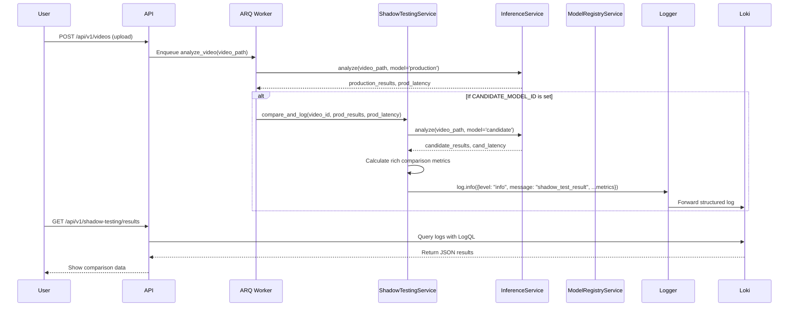

# Shadow Testing Service Design

**Author:** Architect Mode
**Date:** 2025-06-25
**Status:** Proposed

## 1. Overview

This document outlines the design for a `ShadowTestingService` within the AI Video Analysis System. The primary goal of this service is to enable safe, non-disruptive validation of candidate models against the current production model. By running a "shadow" inference in parallel with the main analysis, we can gather comparative performance data without impacting the live service, allowing for data-driven decisions on model promotion.

### 1.1. Design Goals

- **Non-Interfering:** The shadow testing process must not degrade the performance or reliability of the primary video analysis workflow.
- **Insightful:** The system must collect a rich set of comparison metrics to provide a comprehensive understanding of a candidate model's behavior relative to the production model.
- **Observable:** Results must be easily accessible and visualizable through our existing observability stack (Grafana/Loki) to monitor candidate performance in near real-time.
- **Extensible:** The architecture must be modular, allowing for the future addition of new comparison metrics and a potential shift to a fully asynchronous execution model.

## 2. Architecture & Selected Approach

### 2.1. Execution Strategy

For the initial implementation, a **synchronous execution model** is chosen for its simplicity. The main `analyze_video` ARQ task will directly invoke the `ShadowTestingService` after the production inference is complete.

**Justification:** This approach minimizes initial implementation complexity. While it increases the total processing time for a video analysis task when shadow testing is active, it is acceptable for the current scale. The design explicitly plans for a future transition to a more scalable asynchronous model.

### 2.2. Data Storage Strategy

Comparison metrics will be stored via **Structured JSON Logging to Loki**.

**Justification:** This approach perfectly aligns with our MLOps and observability-first strategy. It leverages our existing, scalable logging pipeline (Logger -> Promtail -> Loki) and requires no new database infrastructure. It provides immediate benefits for visualization and dashboarding in Grafana using LogQL and offers a flexible, schema-less way to evolve our metrics over time.

## 3. Workflow Diagram



## 4. Component Design

### 4.1. Configuration

Shadow testing will be controlled by a single environment variable:

- **`CANDIDATE_MODEL_ID`**: The full ID of the model to be tested (e.g., `test_model:v2`). If this variable is not set or is empty, the shadow testing service will not be triggered.

### 4.2. Worker Integration (`worker.py`)

The `analyze_video` task in `src/video_ai_system/worker.py` will be modified as follows:

```python
# src/video_ai_system/worker.py (conceptual change)

async def analyze_video(ctx, video_path: str, video_id: str):
    # ... (existing setup)
    inference_service = ctx["inference_service"]
    shadow_testing_service = ctx["shadow_testing_service"]
    config = ctx["config"]

    # 1. Run production inference
    production_model_id = config.get('production_model_id', 'yolov8n:production')
    prod_results, prod_latency = await inference_service.analyze(video_path, production_model_id)

    # ... (store production results)

    # 2. Trigger shadow testing if configured
    candidate_model_id = config.get('candidate_model_id')
    if candidate_model_id:
        await shadow_testing_service.compare_and_log(
            video_id=video_id,
            production_model_id=production_model_id,
            candidate_model_id=candidate_model_id,
            production_results=prod_results,
            production_latency=prod_latency,
            video_path=video_path # Pass video_path for candidate inference
        )

    return {"status": "complete", "video_id": video_id}
```

### 4.3. `ShadowTestingService`

A new service will be created at `src/video_ai_system/services/shadow_testing_service.py`.

**Class Definition:**

```python
# src/video_ai_system/services/shadow_testing_service.py

import logging
from typing import Dict, Any

class ShadowTestingService:
    def __init__(self, inference_service, logger: logging.Logger):
        self.inference_service = inference_service
        self.logger = logger

    async def compare_and_log(
        self,
        video_id: str,
        production_model_id: str,
        candidate_model_id: str,
        production_results: Dict[str, Any],
        production_latency: float,
        video_path: str
    ):
        """
        Runs inference with a candidate model, compares its results to the
        production model, and logs the comparison metrics.
        """
        # 1. Run candidate inference
        cand_results, cand_latency = await self.inference_service.analyze(
            video_path, candidate_model_id
        )

        # 2. Calculate comparison metrics
        comparison_metrics = self._calculate_metrics(
            production_results, cand_results
        )

        # 3. Structure and log the final result
        log_payload = {
            "message": "shadow_test_result",
            "video_id": video_id,
            "production_model_id": production_model_id,
            "candidate_model_id": candidate_model_id,
            "production_latency_ms": int(production_latency * 1000),
            "candidate_latency_ms": int(cand_latency * 1000),
            **comparison_metrics
        }

        self.logger.info(log_payload)

    def _calculate_metrics(self, prod_res: Dict, cand_res: Dict) -> Dict:
        # Implementation for calculating the rich set of metrics
        # (detection counts, Jaccard similarity, unique classes, etc.)
        # ...
        return {
            "detection_count_prod": len(prod_res.get("detections", [])),
            "detection_count_cand": len(cand_res.get("detections", [])),
            # ... other metrics
        }
```

## 5. Data Schema for Logging

The comparison results will be logged as a structured JSON object. This provides a flexible schema that can be queried effectively in Loki.

**JSON Log Schema:**

```json
{
  "level": "info",
  "message": "shadow_test_result",
  "timestamp": "2025-06-25T18:30:00.123Z",
  "video_id": "vid_abc123",
  "production_model_id": "test_model:v1",
  "candidate_model_id": "test_model:v2",
  "production_latency_ms": 1250,
  "candidate_latency_ms": 1420,
  "detection_count_prod": 15,
  "detection_count_cand": 18,
  "class_jaccard_similarity": 0.85,
  "classes_only_in_prod": ["bicycle"],
  "classes_only_in_cand": ["scooter", "backpack"],
  "avg_confidence_prod": 0.88,
  "avg_confidence_cand": 0.86
}
```

## 6. API Endpoint Design

A new API endpoint will be created to retrieve shadow testing results. This endpoint will act as a proxy, querying the Loki backend and returning the results to the client.

**Endpoint:** `GET /api/v1/shadow-testing/results`

**Query Parameters:**

- `candidate_model_id` (string, optional): Filter results for a specific candidate model.
- `time_range` (string, optional): A time range string like `1h`, `24h`, `7d`. Defaults to `24h`.
- `limit` (int, optional): The maximum number of log entries to return. Defaults to 100.

**Example Request:**
`GET /api/v1/shadow-testing/results?candidate_model_id=test_model:v2&time_range=7d`

**Conceptual Implementation:**

The API handler will construct a LogQL query based on the parameters and send it to the Loki API.

```logql
// Example LogQL query generated by the API
{app="video-ai-system"} | json | message="shadow_test_result" and candidate_model_id="test_model:v2"
```

**Response Body:**

The endpoint will return a JSON array of the log objects retrieved from Loki.

```json
[
  {
    "timestamp": "...",
    "video_id": "...",
    "production_model_id": "test_model:v1",
    "candidate_model_id": "test_model:v2",
    "metrics": {
      "production_latency_ms": 1250,
      "candidate_latency_ms": 1420,
      "detection_count_prod": 15,
      "detection_count_cand": 18,
      "class_jaccard_similarity": 0.85
      // ...
    }
  }
  // ... other results
]
```

## 7. Future Considerations

### 7.1. Asynchronous Execution

To improve throughput and resilience at scale, the shadow testing logic should be moved to a dedicated, low-priority ARQ queue.

- **Trigger:** The `analyze_video` task would publish a `run_shadow_test` task instead of calling the service directly.
- **Payload:** The task payload would include the `video_id`, `production_model_id`, `candidate_model_id`, and the `production_results`.
- **Benefit:** This decouples the lifecycles, ensuring that the primary analysis is not blocked or affected by the shadow testing workload. This refactoring should be considered in a future phase focused on scaling and performance optimization.

## 8. Cross-Mode Instructions

- **For Code Mode:** Implement the `ShadowTestingService`, modify the `worker.py` task, and create the new API endpoint as specified in this document. Ensure unit tests are created for the service's metric calculation logic.
- **For DevOps Mode:** The `CANDIDATE_MODEL_ID` environment variable needs to be added to the deployment configuration (e.g., `docker-compose.yml`, Kubernetes manifests). The value should be easily updatable to allow for testing different candidate models.
