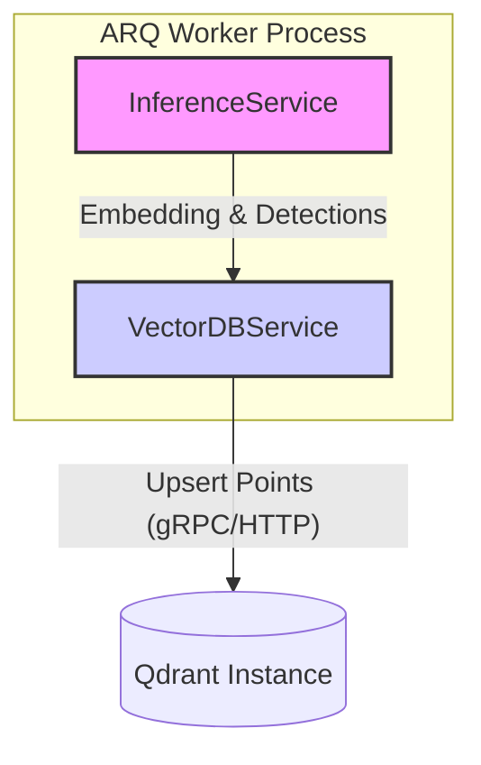

# Vector DB Service Design

**Version:** 1.0
**Status:** Proposed

This document details the design of the `VectorDBService`, a component responsible for persisting inference results, including feature embeddings and metadata, into a Qdrant vector database.

## 1. Executive Summary

To enable advanced features like similarity search, drift detection, and active learning, the system must store the outputs of the inference process. This service abstracts all interactions with the vector database (Qdrant), providing a clean interface for the rest of the application. It will handle connection management, collection creation, and data persistence.

## 2. Service Architecture

The `VectorDBService` will be a standalone service initialized and used by the ARQ worker. It will encapsulate the `qdrant-client` library.

### 2.1. Component Diagram



## 3. Data Model (Schema)

The data will be stored as "points" in a Qdrant collection. Each point will consist of a dense vector (the feature embedding) and a payload containing metadata and raw detection results.

We will define a Pydantic model to represent the payload for type safety and clarity.

**Qdrant Collection Name**: `video_frames`

**Pydantic Payload Model (`src/video_ai_system/services/vector_db_service.py`):**

```python
from pydantic import BaseModel, Field
from typing import List, Dict, Any
import uuid

class Detection(BaseModel):
    """Represents a single object detection."""
    box: List[float] = Field(description="Bounding box coordinates [x1, y1, x2, y2]")
    label: str = Field(description="Class label of the detected object")
    score: float = Field(description="Confidence score of the detection")

class FramePayload(BaseModel):
    """
    Qdrant payload schema for a single video frame's analysis result.
    """
    video_path: str = Field(description="Path or URL of the source video")
    frame_number: int = Field(description="The frame number in the video")
    timestamp: float = Field(description="Timestamp of the frame in seconds")
    model_version: str = Field(description="Version of the model used for inference")
    detections: List[Detection] = Field(description="List of raw object detections")

    # Optional field for any other metadata
    extra_data: Dict[str, Any] = Field(default_factory=dict)

class FramePoint(BaseModel):
    """
    Represents a single point to be upserted to Qdrant.
    """
    id: str = Field(default_factory=lambda: str(uuid.uuid4()))
    vector: List[float]
    payload: FramePayload
```

## 4. `VectorDBService` Interface

The service will be implemented as a class in `src/video_ai_system/services/vector_db_service.py`.

**Configuration (`src/video_ai_system/config.py` update):**
The main `Settings` class should be updated to include Qdrant configuration.

```python
class Settings(BaseSettings):
    # ... existing settings

    # Qdrant settings
    QDRANT_HOST: str = "localhost"
    QDRANT_PORT: int = 6333
    QDRANT_COLLECTION: str = "video_frames"
    EMBEDDING_DIMENSION: int = 512 # Example dimension for YOLOv8 feature map
```

**Class Definition (`src/video_ai_system/services/vector_db_service.py`):**

```python
import qdrant_client
from qdrant_client.http.models import Distance, VectorParams, PointStruct
from video_ai_system.config import settings
from .vector_db_models import FramePoint # Assuming models are in a separate file

class VectorDBService:
    def __init__(self):
        self.client = qdrant_client.QdrantClient(
            host=settings.QDRANT_HOST,
            port=settings.QDRANT_PORT
        )
        self.collection_name = settings.QDRANT_COLLECTION
        self.embedding_dim = settings.EMBEDDING_DIMENSION

    def initialize_collection(self):
        """
        Creates the Qdrant collection if it doesn't already exist.
        This should be called on worker startup.
        """
        try:
            self.client.get_collection(collection_name=self.collection_name)
            print(f"Collection '{self.collection_name}' already exists.")
        except Exception:
            print(f"Collection '{self.collection_name}' not found. Creating...")
            self.client.recreate_collection(
                collection_name=self.collection_name,
                vectors_config=VectorParams(size=self.embedding_dim, distance=Distance.COSINE),
            )
            print("Collection created successfully.")

    def upsert_points(self, points: List[FramePoint]):
        """
        Upserts a batch of points into the Qdrant collection.
        """
        if not points:
            return

        point_structs = [
            PointStruct(
                id=p.id,
                vector=p.vector,
                payload=p.payload.model_dump()
            ) for p in points
        ]

        self.client.upsert(
            collection_name=self.collection_name,
            wait=False, # Fire-and-forget for performance
            points=point_structs
        )
        print(f"Upserted {len(points)} points to '{self.collection_name}'.")

```

## 5. Integration with `InferenceService`

The `InferenceService` (or the pipeline that uses it) will be responsible for extracting the feature embedding and constructing the `FramePoint` objects.

**Conceptual Update to `worker.py`'s `analyze_video` task:**

```python
# In worker.py or a service it calls

# 1. Initialize services
vector_db_service = VectorDBService()
vector_db_service.initialize_collection() # Ensure collection exists on startup

# --- Inside the analyze_video ARQ task ---
async def analyze_video(ctx, video_url: str, **kwargs):
    # ... video processing loop (frame by frame) ...

    points_to_upsert = []
    for frame_number, frame in enumerate(video_frames):
        # 2. Run inference
        detections, feature_embedding = inference_service.run_inference_with_embedding(frame)

        # 3. Create payload
        payload = FramePayload(
            video_path=video_url,
            frame_number=frame_number,
            timestamp=frame_number / video_fps, # Example timestamp
            model_version="yolov8n_v1", # Get from model registry
            detections=[Detection(**d) for d in detections]
        )

        # 4. Create point
        point = FramePoint(
            vector=feature_embedding.tolist(), # Convert numpy array to list
            payload=payload
        )
        points_to_upsert.append(point)

        # 5. Batch upsert to avoid overwhelming the DB with single requests
        if len(points_to_upsert) >= 50: # Batch size of 50
            vector_db_service.upsert_points(points_to_upsert)
            points_to_upsert.clear()

    # Upsert any remaining points
    if points_to_upsert:
        vector_db_service.upsert_points(points_to_upsert)

    # ... rest of the task ...
```

This design provides a clear separation of concerns, ensures data integrity through Pydantic models, and establishes a robust foundation for persisting and later querying inference results.
